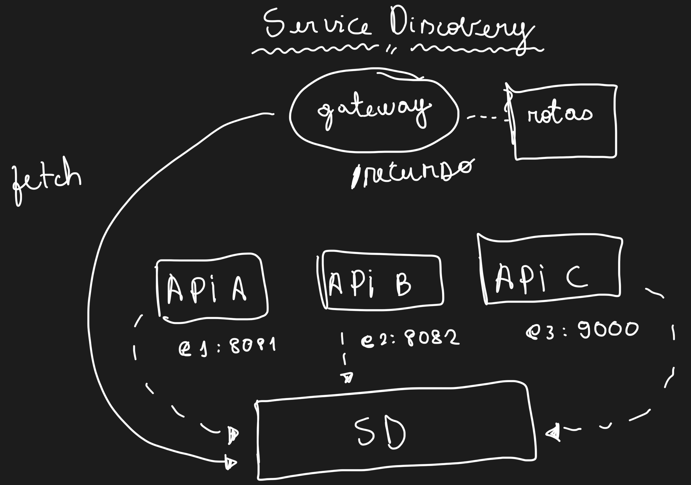

<h1 align="center">
  Service Discovery
</h1>

<p align="center">
 
 
</p>

Tutorial apresentado [nesse vídeo](https://youtu.be/ju7NTqJxKRs) que demonstra como utilizar o Service Discovery Pattern com Spring Cloud Netflix Eureka.
O projeto contém 2 APIs Spring Boot, 1 Spring Cloud Gateway e 1 Eureka Service Discovery.



## Tecnologias

- [Spring Boot](https://spring.io/projects/spring-boot)
- [Spring Cloud Gateway](https://spring.io/projects/spring-cloud-gateway)
- [Eureka Service Discovery](https://cloud.spring.io/spring-cloud-netflix/reference/html/)

## Como Executar

- Clonar repositório git:
```
git clone https://github.com/giuliana-bezerra/service-discovery.git
```
- Construir os projetos:
```
./mvnw clean package
```
- Executar os projeto:
```
java -jar <projeto>/target/<nome>-0.0.1-SNAPSHOT.jar
```